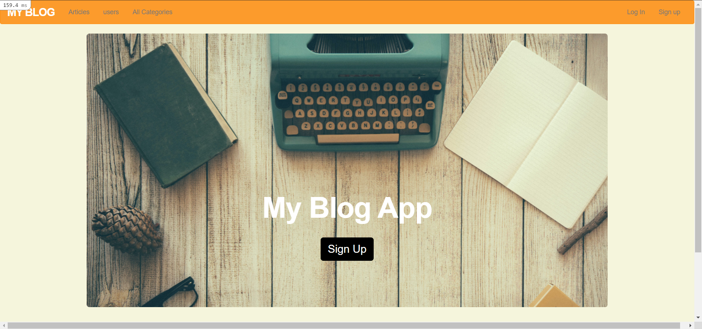
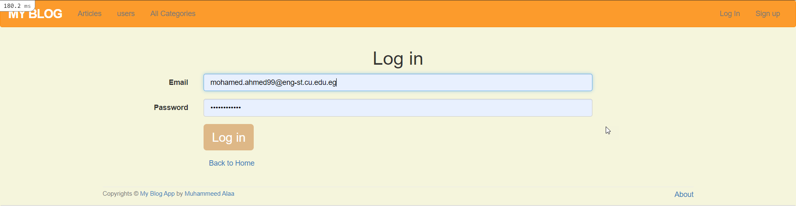
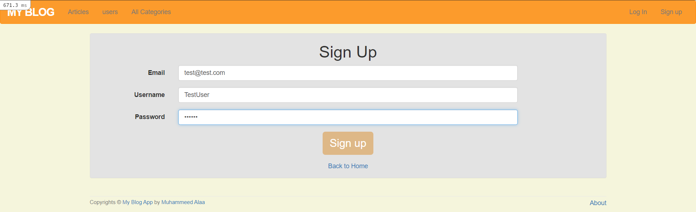
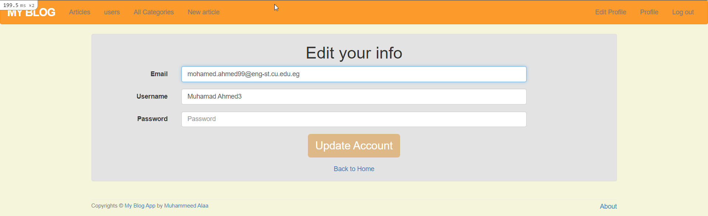
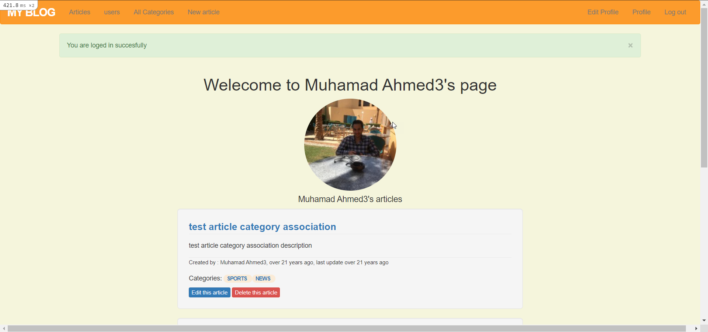
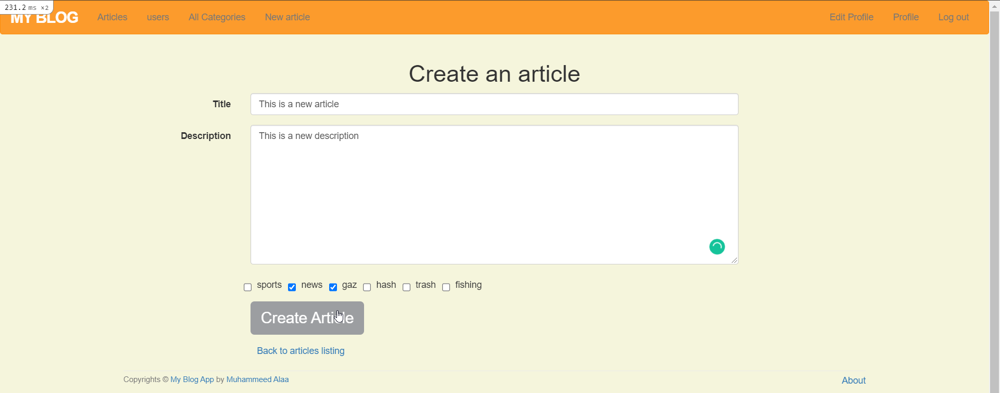
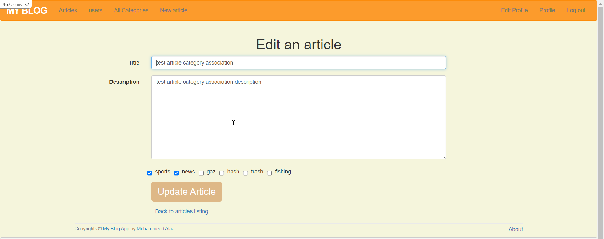
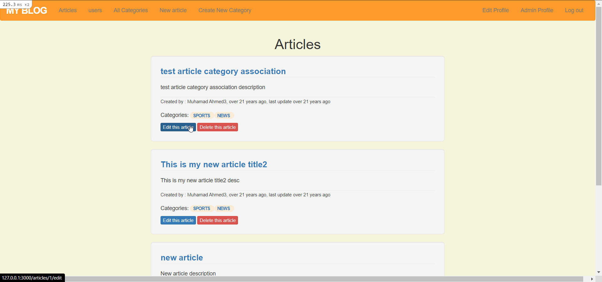
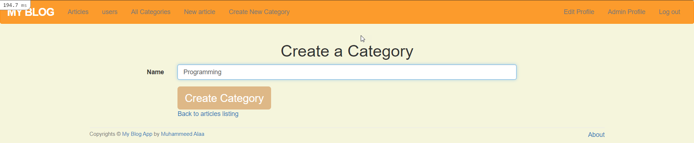
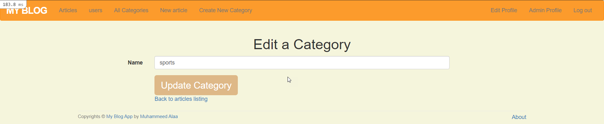

 
    

# Table of contents

- [Description](#Description)
- [Screenshots](#Screenshots)
- [Technologies](#Technologies)
- [Contributers](#Contributers)

# Description

Alaa-Blog is an app that has users that can sign in and sign up and create thier aricles in different categories[Deployed App](https://alaa-blog-2021.herokuapp.com/).

# 📷 Screenshots

## 🔑 User Management

## 🙍‍♂️ User

## 🔐 Admin panel

# Technologies

## Frontend

- Embedded ruby

## Backend

- Ruby on rails
- SQL

# Contributers

- [Muhammed Alaa](https://github.com/MuhammeedAlaa)
